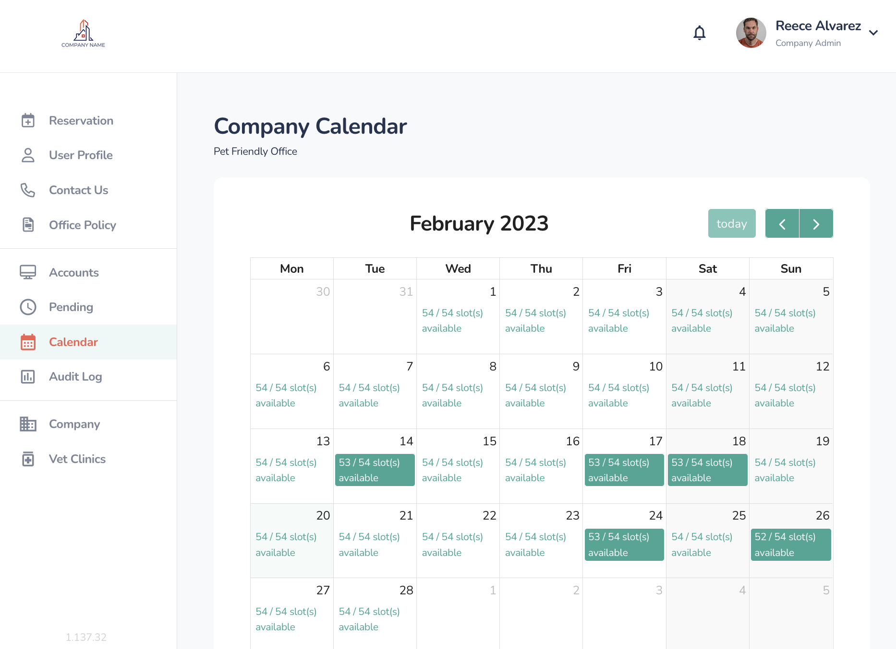
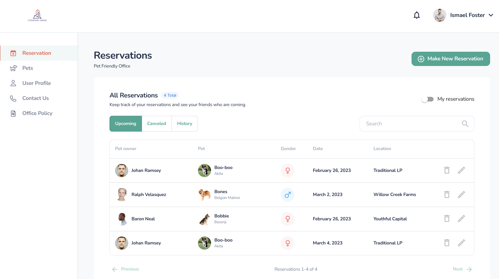
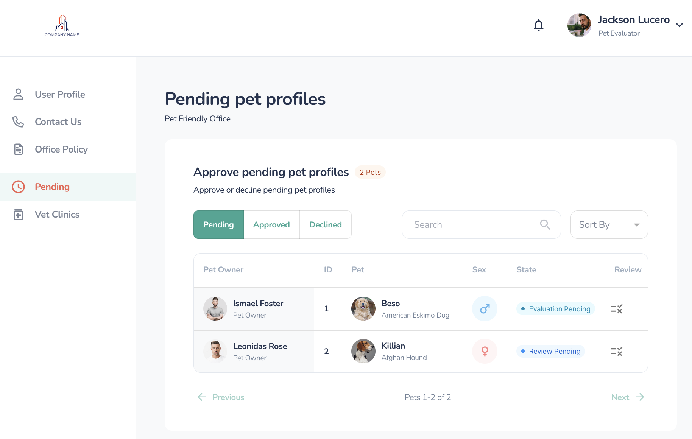

# Connected Canine User's Guide

The Connected Canine Platform provides access to a complete workflow for Companies and Pet Owners to register themselves, their respective pets, evaluate, approve, and reserve days to bring their pets into the office.

There are Three Active Roles - Company Administrator, Pet Owner, and Pet Evaluator. The Property Manager Role is currently a reporting role where reports are emailed on a monthly basis. 

| [Property Manager](propertymanager.md) - Utilization Reports | [Company Administrator](companyadmin.md) - Administer Pet Owners and Pets |
| ------------------------------------------------------------ | ------------------------------------------------------------ |
|                                                              |  |
| [**Pet Owner**](PetOwner.md) - Register Pets and Reserve Days | [**Pet Evaluator**](petevaluator.md) -                       |
|  |  |

