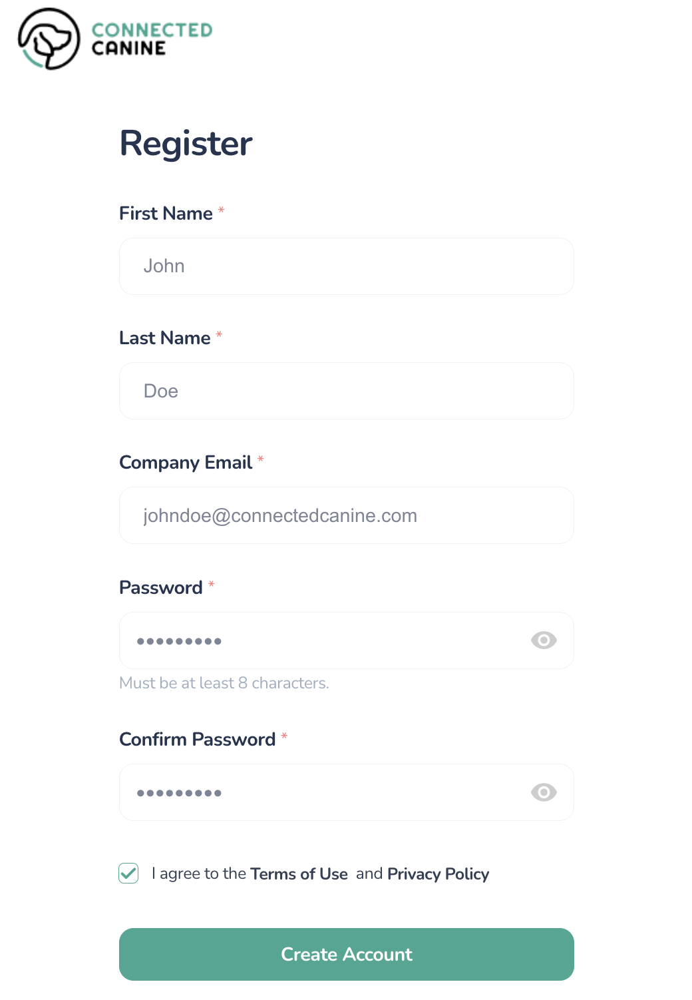
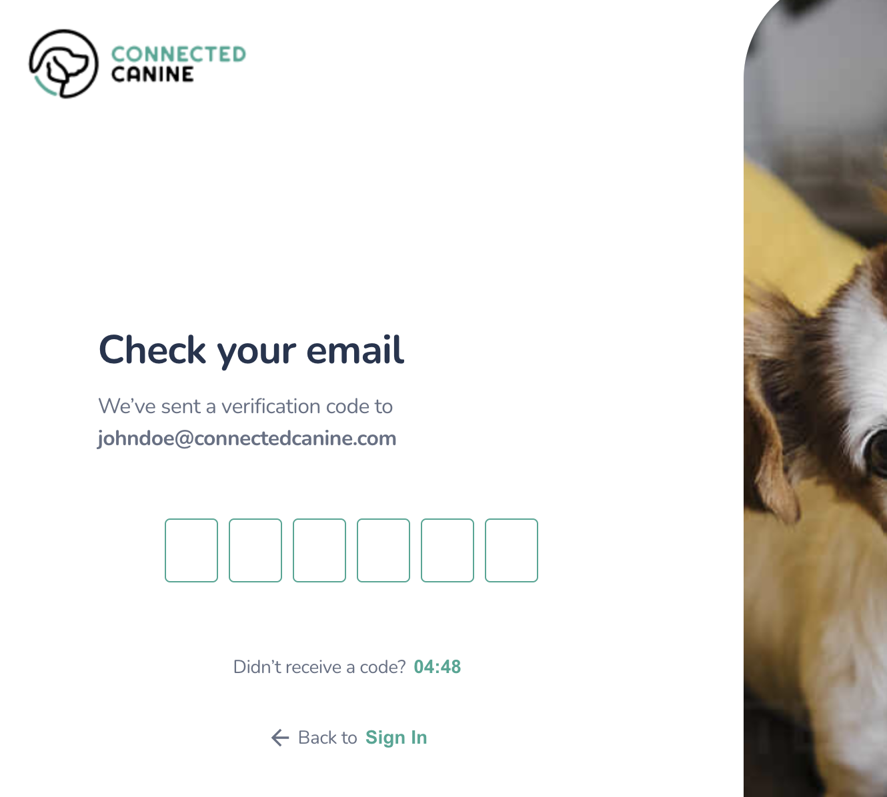
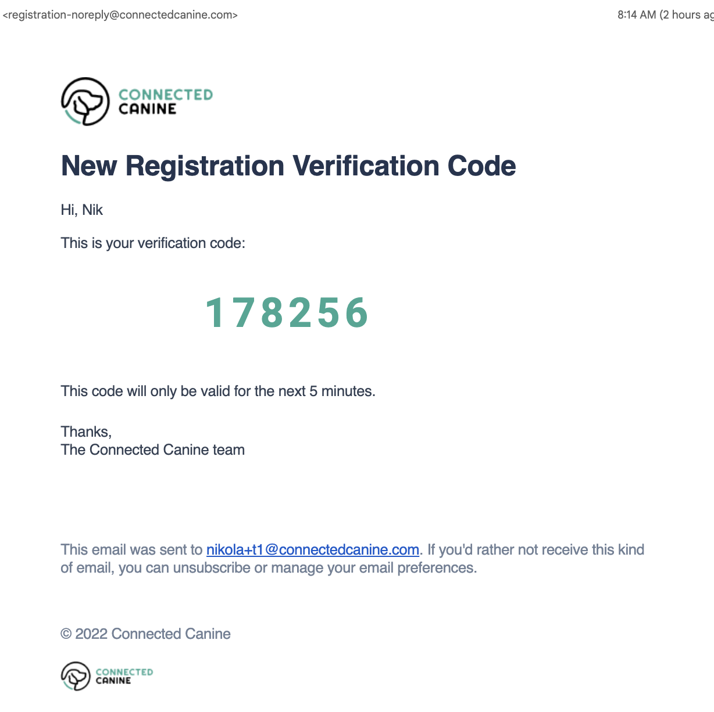
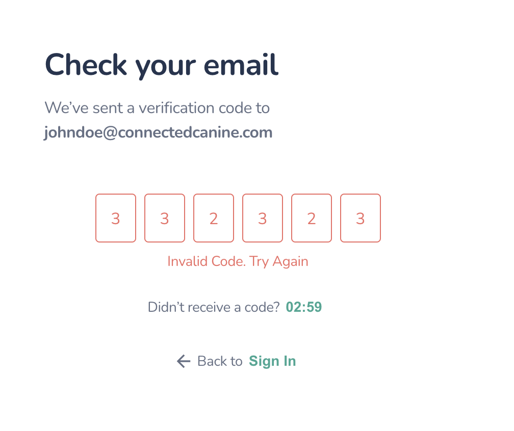
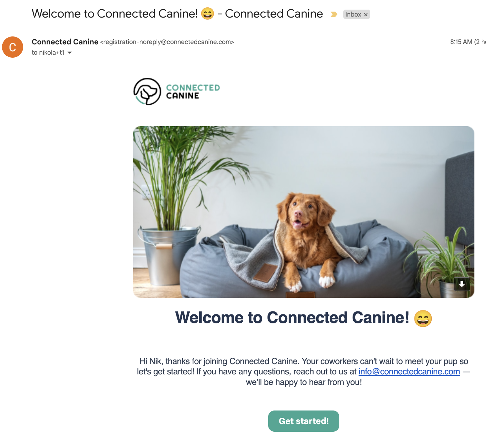
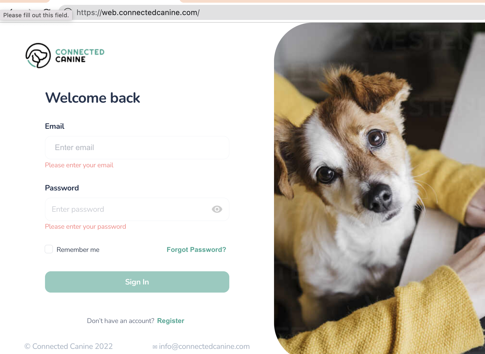
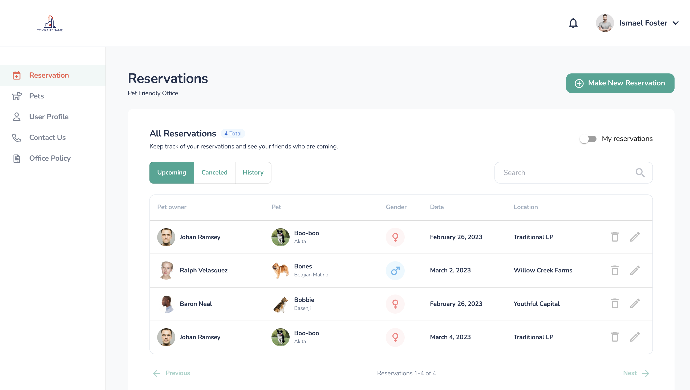

# Connected Canine Registration

Connected Canine Platform is designed to allow ALL company employees to login and access the site through a simple self-regristration process. Once a company is setup by Connected Canine, then all employees of a company's corporate domain may login to the site.

Once a user registers, it is easy to review the company Pet Policy, register to bring a Pet to office, or ask for support.

The initial company administrator may receive an account email directly from Connected Canine setup for them. 

### Help

Email help@connectedcanine.com for any questions. You may also send a help question through the portal

## Self-Registration

Users select 'Register' under the 'Sign In' button initiates the registration process.

### Complete Registration Information

Required First Name and Last Name as well as Company email (Must be your company's domain).

**Password Policy:**

​	*Eight (8) Characters*

​	*Must contain, one uppercase, one lowercase, one number and one special case character*

### Verification Code

A verification code will be sent to your email address to confirm your email address is real and working.

The email will look similar to the one below with a verification code coming from *registration-noreply@connectedcanine.com.*

### Incorrect Code

If you enter an incorrect code or don't respond within 5 minutes. You may re-register.

Select the timer after "Didn't receive a code?" to resend the verification code to. yourr email address.

If you are unable to access or provide incorrect response repeatedly, you may repeat the registration process anew from the "Sign In" page.

### Email Welcome

Once you register, a welcome email is sent to your account.

## Login

If you have previously registered, then enter your company email address and password to login.

## 

Successful login brings you to the main screen.

## Password Reset

If you forget your password, you may reset it from the main login screen by using the password reset feature.

