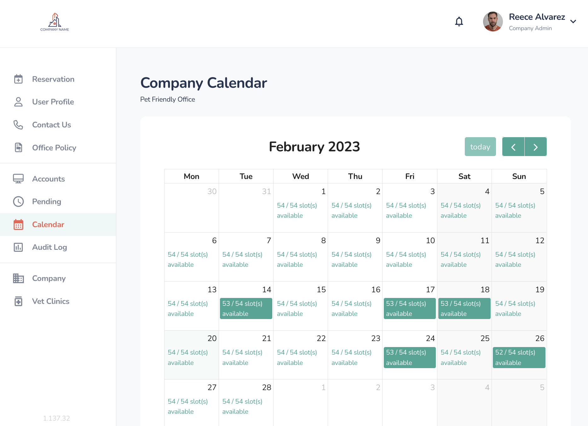
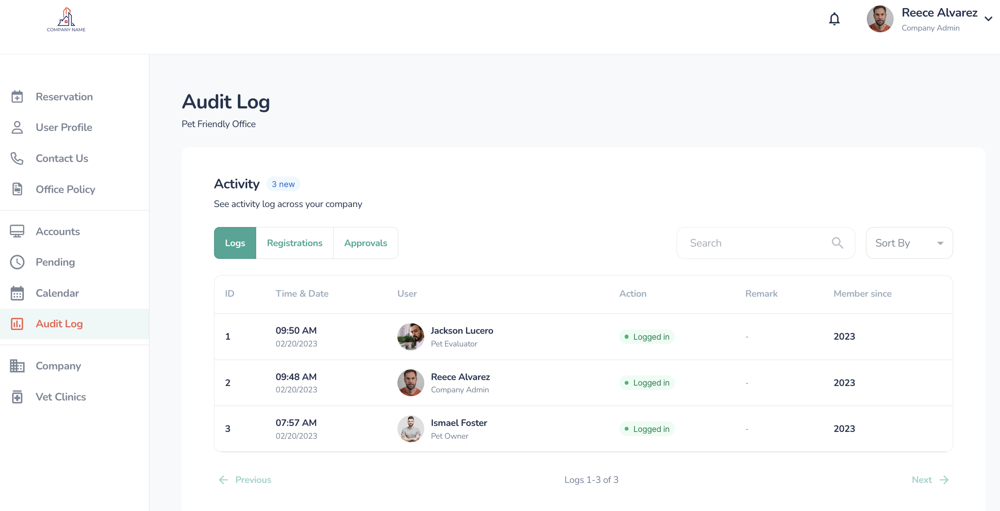
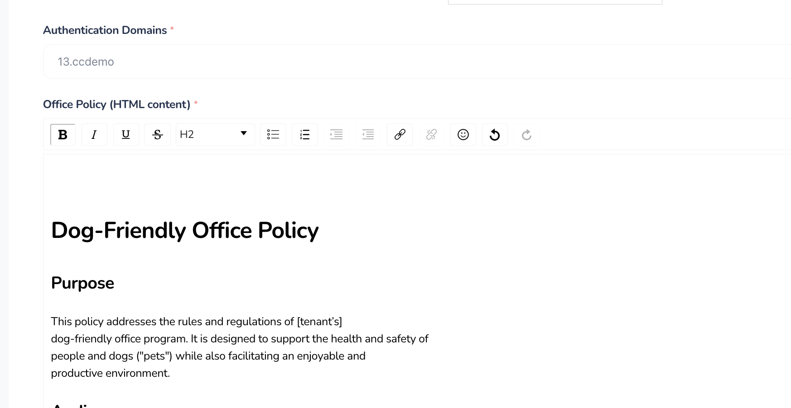
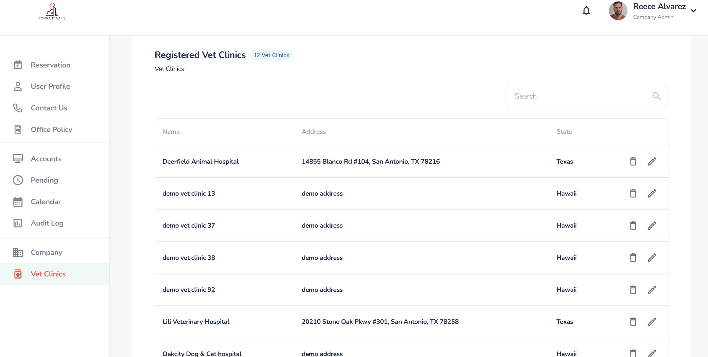
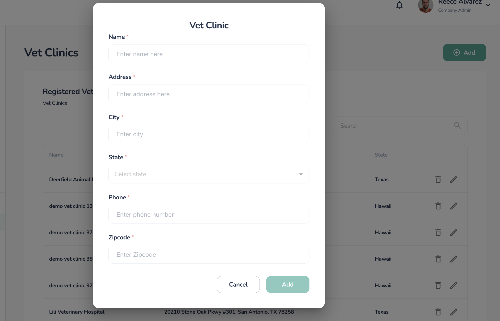

The company administrator role provides a company adminstrator 

## Administration

Connected Canine will crerate an account for your company and assign one or more members as company administrators initially, define the authentication

## Accounts

## Pending

## Audit Log

## Registration Calendar

## Audit Logs

The audit logs document all actions that affect users or system changing actions such as login/logout, and registration.

## Company

Company Admins can update a number of parameters to customize the portal for their employees.

| Element       | Description | Notes |
| ------------- | ----------- | ----- |
| Name          |             |       |
| Email         |             |       |
| Domain        |             |       |
| Location      |             |       |
| Logo Uri      |             |       |
| Office Policy |             |       |
|               |             |       |

## Vet Clinics

Vet Clinics page allows you to orr update Vet Clinics that are relevant to your employees. Connected Canine has prepoluated the list with many of common Vet clinics found in supported

Items with a red asterisk are required before being able to the Veternarian Clinic. 